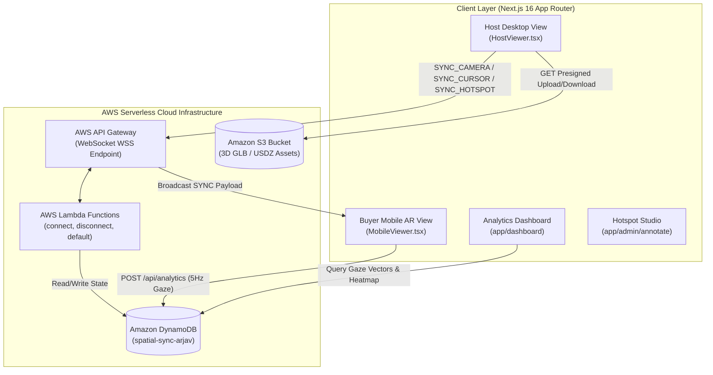

# 🛸 SpatialSync AR

> **Real-Time Synchronized 3D Spatial Pitches & WebXR Buyer Analytics Platform**

SpatialSync AR is an enterprise Augmented Reality (AR) sales presentation and spatial analytics platform built with **Next.js 16**, **TypeScript**, **AWS Serverless (API Gateway WebSockets, Lambda, DynamoDB, S3)**, and **Google `@google/model-viewer`**. 

It enables Sales Reps to host live 3D product demonstrations on Desktop/Tablet while prospective buyers join on Mobile devices to inspect high-fidelity 3D models placed directly in their physical room in **1:1 scale AR**.

---

## 📸 Executive Summary & Key Highlights

Traditional remote sales pitches rely on static 2D screen shares or slides, which fail to convey physical scale, depth, and spatial ergonomics of complex products (such as medical devices, heavy industrial machinery, architectural structures, or high-end furniture).

**SpatialSync AR solves this by providing:**
1. **Live Dual-POV Synchronization:** Smooth 60fps camera orbit lerping between Host desktop controls and Buyer mobile devices.
2. **Real-Time 3D Laser Pointer:** Continuous mouse-surface tracking (~30fps) that projects a glowing spatial red dot onto the 3D model surface across WebSockets.
3. **Host-Driven Hotspot Guidance:** Selecting a hotspot component on the Host screen automatically highlights the annotation, title, description, and technical specs sheet overlay on the buyer's screen.
4. **Physical Buyer Analytics & 3D Heatmaps:** Captures 3D buyer gaze vectors, physical proximity (distance in meters), and session duration, rendering a 3D heatmap overlaid onto the product model.
5. **Modern Monochrome B&W Aesthetic:** Built with shadcn UI, Tailwind CSS v4, and a high-contrast dark theme.

---

## 🏗️ Architecture & Technology Stack



### Stack Breakdown

* **Framework:** Next.js 16 (App Router, Turbopack, React 19, TypeScript)
* **UI & Styling:** Tailwind CSS v4, shadcn UI (`cva`, `@radix-ui/react-slot`, `clsx`, `tailwind-merge`), Lucide Icons, QRCode SVG
* **3D & AR Engine:** `@google/model-viewer` (WebXR Device API, Apple iOS QuickLook `.usdz`, Android SceneViewer `.glb`)
* **State & Real-Time Sync:** Zustand (`useSpatialStore`), Custom `useSpatialSync` React Hook
* **Real-Time Backend:** AWS API Gateway WebSockets + AWS Lambda (`nodejs20.x`)
* **Database & Storage:** Amazon DynamoDB (Pay-per-request table `spatial-sync-arjav`), Amazon S3
* **Authentication:** NextAuth.js Credentials Provider

---

## 🔥 Key Features

### 1. 🎯 Real-Time 3D Laser Pointer
- Host toggles **Laser Pointer ON** in the header.
- Moving the mouse across the 3D model continuously computes surface hit coordinates ($x, y, z$) and normals ($n_x, n_y, n_z$) at 30fps via `positionAndNormalFromPoint()`.
- Sends WebSocket `SYNC_CURSOR` payloads to the buyer's phone.
- Renders a 3D red dot (`14px` solid red dot with white border & glowing red halo) dynamically re-slotted onto the 3D surface on both screens.

### 2. 📌 Interactive Hotspot Annotation Studio (`/admin/annotate`)
- Reps click on any 3D model surface to place interactive pins.
- Configure label, title, description, category, display order, and camera viewpoints (`cameraOrbit` & `cameraTarget`).
- Selecting a hotspot in Host view automatically focuses the buyer's camera and displays an interactive specification card overlay.

### 3. 📊 Spatial Gaze Analytics & 3D Heatmap (`/dashboard`)
- Buyer mobile view logs camera position vectors at 5Hz into a memory buffer and POSTs to `/api/analytics` every 5 seconds.
- Calculates:
  - **Total Gaze Points** recorded.
  - **Average Buyer Proximity** (Euclidean distance to product origin in meters).
  - **Session Duration** (seconds).
  - **3D Heatmap Grid Overlay:** Normalizes theta/phi angles onto an SVG gradient overlay rendered directly over the 3D model viewer.

### 4. 🛋️ Mobile AR Experience (`View in My Room`)
- Detects mobile OS (iOS vs Android).
- On WebXR-compatible mobile browsers (Android Chrome / WebXR), launches immersive floor-placement AR with touch gesture controls (pinch to scale, drag to translate, twist to rotate).
- On iOS (Safari / Chrome), provides native USDZ QuickLook integration.

### 5. 📁 Direct S3 Presigned Upload Pipeline (`/admin`)
- Upload custom `.glb` and `.usdz` files (up to 50MB) directly from browser to Amazon S3 using presigned PUT URLs (`/api/upload`).
- Pre-loaded enterprise 3D model library:
  - 🛌 **Hospital Bed** (`assets/HospitalBed.glb`)
  - 🏥 **MRI Scanner** (`assets/MRI.glb`)
  - 🏢 **Hospital Facility Floor Plan** (`assets/Hostipal.glb`)
  - ⚙️ **Industrial Drill Press** (`assets/drilling.glb`)
  - 🛋️ **Executive Lounge Sofa** (`assets/demo.glb`)

---

## 🚀 Application Route Directory

| Route | Purpose | Access |
|---|---|---|
| `/` | Landing page & Sales Rep login trigger | Public |
| `/auth/signin` | Sales Rep authentication portal | Public / Credentials |
| `/rep` | Rep Dashboard (Start Session / View Analytics) | Authenticated Reps |
| `/admin` | Available 3D Models & Dropzone Model Upload | Authenticated Reps |
| `/admin/annotate` | 3D Hotspot Annotation Editor Studio | Authenticated Reps |
| `/session/[id]` | Dynamic Session Router (Host Desktop vs Mobile Viewer) | Session Link / QR Code |
| `/dashboard` | Spatial Buyer Analytics & 3D Engagement Heatmap | Authenticated Reps |

---

## ⚙️ Environment Configuration (`.env.local`)

To run SpatialSync locally or deploy to Vercel, configure the following environment variables:

```env
# NextAuth Configuration
NEXTAUTH_SECRET=spatialsync-secret-key-123456789
NEXTAUTH_URL=http://localhost:3000

# AWS Infrastructure
AWS_REGION=eu-central-1
AWS_ACCESS_KEY_ID=your-aws-access-key-id
AWS_SECRET_ACCESS_KEY=your-aws-secret-access-key
AWS_SESSION_TOKEN=your-aws-session-token-if-using-sso

# S3 & DynamoDB Resources
S3_BUCKET_NAME=spatial-sync-arjav
NEXT_PUBLIC_S3_BUCKET=spatial-sync-arjav
DYNAMODB_TABLE_NAME=spatial-sync-arjav

# Serverless WebSocket WSS Endpoint
NEXT_PUBLIC_WEBSOCKET_URL=wss://8t20x6jssb.execute-api.eu-central-1.amazonaws.com/dev
```

---

## 🛠️ Local Development Setup

### 1. Clone & Install Dependencies
```bash
git clone git@github.com:arjav1528/Spatial-Sync-AR.git
cd Spatial-Sync
npm install
```

### 2. Run Next.js Development Server
```bash
npm run dev
```
Open [http://localhost:3000](http://localhost:3000) in your browser.

### 3. Verify Production Build
```bash
npm run build
```

---

## ⚡ Serverless WebSocket Deployment (AWS)

The serverless WebSocket service resides in `./serverless`.

```bash
cd serverless

# Deploy to AWS API Gateway & Lambda
npx serverless deploy
```

**Deployed Functions:**
- `connect`: `$connect` route (stores connection ID in DynamoDB).
- `disconnect`: `$disconnect` route (purges stale connection records).
- `default`: `$default` route (handles & broadcasts `SYNC_CAMERA`, `SYNC_CURSOR`, and `SYNC_HOTSPOT` actions).

---

## 🎨 Theme & UI Guidelines

SpatialSync AR enforces a strict **Black & White (Monochrome) + Red Destructive** aesthetic:
- **Backgrounds:** `bg-zinc-950` (Page), `bg-zinc-900` (Cards/Containers)
- **Borders:** `border-zinc-800`
- **Text:** `text-white` (Headings/Active), `text-zinc-400` (Muted/Secondary)
- **Primary Buttons:** High-contrast White box (`bg-white text-zinc-950 hover:bg-zinc-200`)
- **Destructive Actions:** Red (`bg-red-600 hover:bg-red-700 text-white`) reserved strictly for "End Session" and "Delete".

---

## 📜 License & Acknowledgments

Built for multi-device spatial sales presentations and WebXR buyer intelligence. Powered by Next.js, AWS Serverless, and Google `@google/model-viewer`.
